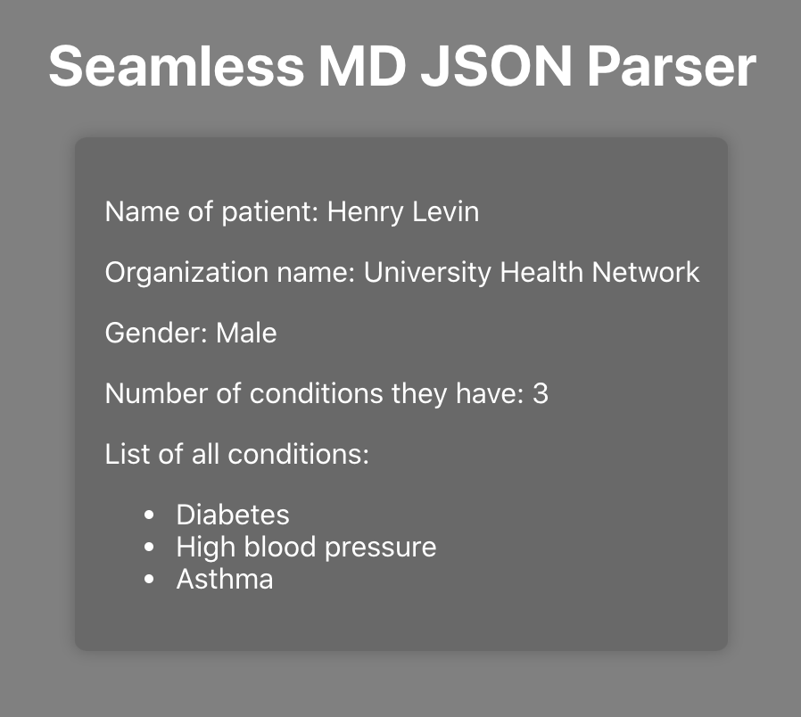

# JSON Parser

A web app that parse and display information from a JSON object.

## Setup

1. Install dependencies in both main folder and server directory using npm install.
2. From the main directory: npm start.
3. From the server directory: npm start.
4. From the client directory: npm start.
5. Visit http://localhost:3000/

## Screenshot

## Stack
  * React
  * Node.JS
  * Express